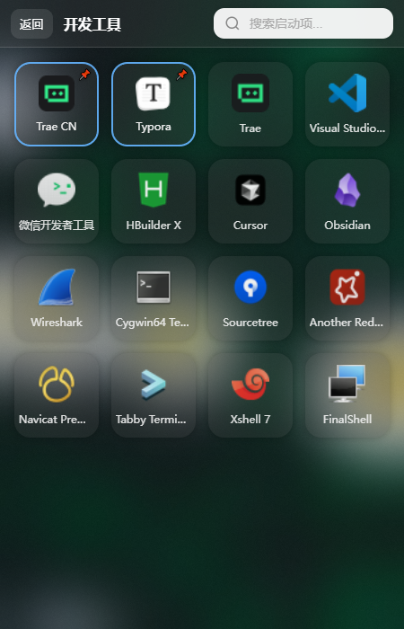

# Air Icon Launcher

🚀 **极速启动器** - 用分类整理你的桌面图标，一搜即达


一个轻量级的 Windows 桌面启动器，基于 Tauri 构建。通过分类管理你的应用程序，支持全局搜索、插件扩展，让你告别杂乱的桌面。

当前版本面向 Windows 使用与开发环境，开源协作默认以 Windows 为目标平台。

---

## ✨ Features

### 📁 分类管理

将应用程序按用途分类整理，工作、娱乐、开发工具各归其位。

<!-- 图片：主界面截图 - 展示分类卡片网格、搜索框、固定项区域 -->



### 🔍 全局搜索

输入关键词，实时搜索所有分类中的应用。支持拼音搜索，中文应用名也能快速找到。

<!-- 图片：搜索动图 - 输入关键词后实时显示搜索结果 -->


### 📌 固定 & 最近使用

将常用应用固定在顶部，最近使用的应用自动记录，一键直达。

<!-- 图片：截图 - 展示固定项和最近使用区域 -->


### 🎯 拖拽排序

拖拽图标自由排列，拖拽分类调整顺序，个性化你的启动器布局。

<!-- 图片：拖拽动图 - 展示图标在分类内拖拽重排 -->


### 🖱️ 右键菜单

右键点击图标，快速访问编辑、删除、固定等操作。

<!-- 图片：截图 - 展示图标右键菜单选项 -->

### 🪟 毛玻璃效果

原生 Windows 11 Acrylic 毛玻璃效果，透明窗口融入桌面背景。

<!-- 图片：截图 - 展示 Windows 11 下的 Acrylic 毛玻璃效果 -->

### 🔌 插件扩展

通过插件扩展功能：右键菜单扩展、剪贴板操作、自定义命令等。

<!-- 图片：截图 - 展示插件管理页面和权限确认对话框 -->

---

## 🚀 Quick Start

### 1. 下载安装

从本仓库的 Releases 页面下载最新版本安装包，双击安装即可。

<!-- 图片：Releases 页面截图 - 展示下载选项 -->

### 2. 添加图标

- **拖拽添加**：将文件或快捷方式拖拽到启动器窗口
- **手动添加**：点击分类卡片进入详情，点击添加按钮选择文件

<!-- 图片：动图 - 展示拖拽文件到窗口的操作 -->

### 3. 开始使用

- 按 `Alt + Space`（可自定义）呼出启动器窗口
- 输入关键词搜索应用
- 点击或回车启动应用

<!-- 图片：动图 - 展示快捷键呼出 + 搜索启动流程 -->

### 4. 开发前置环境

- Windows 10 / 11
- Bun 1.x
- Rust stable toolchain
- Visual Studio C++ Build Tools（MSVC）
- Microsoft Edge WebView2 Runtime

---

## 📸 Screenshots

<!-- 图片：主界面 - 空白状态下的主界面，展示搜索框、固定区、最近区、分类网格 -->

<!-- 图片：搜索中 - 输入关键词后的搜索结果界面 -->

<!-- 图片：分类详情 - 点击分类后进入的分类详情页，展示图标网格 -->

<!-- 图片：设置页 - 设置页面，展示外观、窗口、快捷键等选项 -->

<!-- 图片：插件管理 - 插件列表页面，展示已安装插件和权限信息 -->

---

## 🔌 Plugin Example

创建一个简单的插件只需两个文件：

### manifest.json

```json
{
  "id": "com.example.hello",
  "name": "Hello Plugin",
  "version": "1.0.0",
  "description": "一个简单的示例插件",
  "main": "main.js",
  "permissions": ["toast"]
}
```

### main.js

```javascript
(function(manifest, api) {
  return {
    onLoad: function() {
      api.ui.showToast('Hello from ' + manifest.name + '!', 'success');
    }
  };
});
```

将这两个文件放入 `plugins/hello-plugin/` 目录，重启应用即可加载。

<!-- 图片：插件加载后的 Toast 提示截图 -->

### 可用权限

| 权限 | 风险等级 | 说明 |
|------|---------|------|
| `launcher.read` | 低 | 读取分类和启动项列表 |
| `launcher.open` | 中 | 启动应用程序 |
| `storage.local` | 低 | 使用本地存储 |
| `toast` | 低 | 显示通知消息 |
| `contextMenu` | 中 | 扩展右键菜单 |
| `clipboard.readText` | 高 | 读取剪贴板文本 |
| `clipboard.writeText` | 高 | 写入剪贴板文本 |

---

## ⚠️ Security Notice

Air Icon Launcher 采用多层安全机制保护你的系统：

### 🏠 沙箱隔离

插件运行在独立的 iframe 沙箱中，与主应用完全隔离：

- ❌ 阻止访问 `localStorage`、`sessionStorage`、`indexedDB`
- ❌ 阻止操作 DOM 和修改页面内容
- ❌ 阻止页面跳转和访问父窗口

<!-- 图片：沙箱隔离测试截图 - 控制台展示各项隔离测试通过 -->

### 🔐 权限控制

插件必须在 `manifest.json` 中声明所需权限：

- **低风险权限**：自动授权
- **中风险权限**：弹窗确认
- **高风险权限**：需要用户输入确认文字才能授权

<!-- 图片：高风险权限确认对话框截图 - 展示需要输入确认文字的 UI -->

### 🧭 本项目的安全边界

- 这是本地桌面启动器，不是浏览器型沙箱应用
- 为了支持任意本地快捷方式、可执行文件、图标与导入资源，当前 Tauri `opener` 与 `fs` 能力允许访问用户选择的本地路径
- 为了加载本地资源与插件内容，当前配置启用了较宽的资源访问范围，并未启用严格 CSP
- 仅建议加载你信任的本地插件、快捷方式和资源文件
- 如果你计划二次分发或扩展插件生态，建议先根据自己的发布模型收紧 capability 与资源访问策略

### 🧹 资源清理

插件禁用或卸载时，自动清理：

- 注册的右键菜单项
- 注册的命令
- 事件监听器
- 本地存储数据

---

## 🧱 Architecture

```
┌─────────────────────────────────────────────────────┐
│                    Frontend (Vue 3)                  │
│  ┌─────────┐  ┌─────────┐  ┌─────────────────────┐  │
│  │  Views  │  │ Stores  │  │   Plugin System     │  │
│  │ (Pages) │  │ (Pinia) │  │ ┌─────┐ ┌────────┐  │  │
│  └────┬────┘  └────┬────┘  │ │ API │ │ Sandbox│  │  │
│       │            │       │ └──┬──┘ └───┬────┘  │  │
│       └────────────┴───────────┼────────┘       │  │
│                               │                  │  │
└───────────────────────────────┼──────────────────┘
                                │ Tauri IPC
┌───────────────────────────────┼──────────────────┐
│                    Backend (Rust)                  │
│  ┌─────────────┐  ┌─────────────┐  ┌───────────┐  │
│  │   Commands  │  │   Search    │  │ Clipboard │  │
│  │   (API)     │  │   Engine    │  │  Manager  │  │
│  └─────────────┘  └─────────────┘  └───────────┘  │
└─────────────────────────────────────────────────────┘
```

### Tech Stack

| 层级 | 技术 |
|------|------|
| Frontend | Vue 3 + TypeScript + Pinia + Vue Router |
| Backend | Rust + Tauri 2 |
| Plugin | iframe Sandbox + Permission System |
| Build | Vite + Bun |

---

## 📄 License

[MIT](LICENSE)

---

## 🤝 Contributing

欢迎提交 Issue 和 Pull Request！

---

## 🛠️ Development

```bash
# 安装依赖
bun install

# 前端类型检查
bun run typecheck

# 前后端综合检查
bun run check

# Rust 测试
bun run test

# 启动开发模式
bun tauri dev

# 构建发布版本
bun tauri build
```

**推荐 IDE**：VS Code + Vue - Official + Tauri + rust-analyzer
