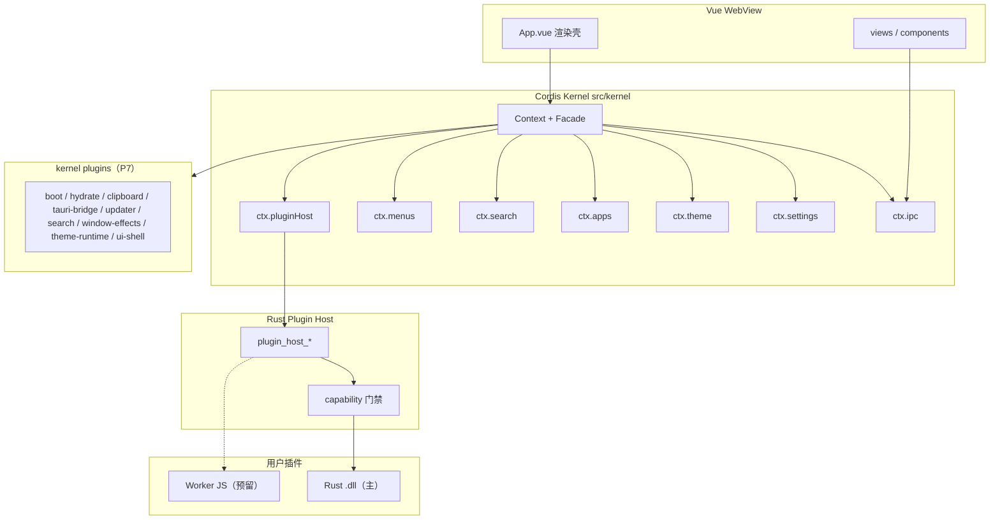

# Cordis 插件化重构总览（P1–P8 + IR + PERF-A）

> Air Icon Launcher · Tauri 2 + Vue 3 · Cordis 宿主内核 + Rust 能力插件宿主  
> 目标：**一切皆插件**；**iframe 插件系统已下线（IR）**，仅保留 Rust Host + `ctx.menus` 扩展点。  
> PERF-A：solar-icons 拆 runtime+data 且只保留用到的 weight；vite manualChunks 拆 icons/cordis/marked；clipboard 预载 idle；useSearch debounce+seq。

## 分层



| 层 | 职责 |
|----|------|
| Vue 壳 | 路由、对话框、菜单渲染；无业务 `onMounted` 副作用 |
| Cordis Kernel | 能力皆 Service；扩展皆 Plugin + `inject`；状态用 Vue `ref` |
| Rust Plugin Host | cdylib ABI v1、capability 强制、`plugin_host_*` 命令 |
| Pinia | 过渡期适配层（共享 ref / 委托写）；真相在 Service |

## 服务表

| Service | 槽位 | 职责 |
|---------|------|------|
| IpcService | `ctx.ipc` | 唯一 Tauri invoke/listen 封装（invoke-wrapper） |
| SettingsService | `ctx.settings` | `get_config` / `patch_config` / `save_config` |
| ThemeService | `ctx.theme` | 主题模式、性能/特效运行时、DOM 应用 |
| AppsService | `ctx.apps` | 条目/分类/启动/save·load **单源写入口** |
| SearchService | `ctx.search` | 查询 + Rust 索引同步（依赖 apps） |
| MenuContributionService | `ctx.menus` | 菜单贡献扩展点（facade → `src/menus/contextMenuRegistry` 单列表） |
| PluginHostService | `ctx.pluginHost` | Rust Host 列表/启停/invoke/日志/事件 |

业务代码：**只** `from "@/kernel"`（或相对 kernel Facade）；**禁止** `from "cordis"`；**禁止**直连 `@tauri-apps/api/core`（唯一合法处：`src/utils/invoke-wrapper.ts`）。

## 启动顺序

详见 `docs/architecture/cordis-app-boot.md`。

```
applyBootTheme()
→ new Ipc / Settings / Theme / Apps / Search / Menus / PluginHost
→ ctx.plugin(bootTheme)
→ hydrate-settings → clipboard-runtime
→ tauri-bridge → updater → search-runtime
→ window-effects-boot → theme-runtime → ui-shell-runtime
```

关键服务在 bootstrap 内 **同步 `new Service(ctx)`**（root fiber ACTIVE）；`ctx.plugin` 构造在 microtask，勿用于 mount 竞态路径。

## 插件运行时

| 运行时 | 状态 | 说明 |
|--------|------|------|
| **Rust cdylib** | 主路径 | manifest v2 + `runtime=rust`；能力见 `plugin-host.md`；示例 `plugins/example-rust-plugin` |
| **Worker JS** | 预留 | 能力加强版 JS；未实现 |
| **旧 iframe JS** | **已下线（IR）** | 前端 `src/plugins/*`、`plugins.rs` 命令、旧 UI/示例已删除；菜单注册表迁至 `src/menus/contextMenuRegistry.ts` |

## 如何扩展

### 新增 Cordis Service

1. `src/kernel/services/foo-service.ts`：`export class FooService extends Service { constructor(ctx){ super(ctx,"foo") } }`
2. `types.ts`：`declare module "cordis"` + `KernelContext` 槽位
3. `bootstrap.ts`：`new FooService(ctx)`（启动关键）
4. `index.ts`：从 service 文件导出 class（避免与 type 同名 TS2300）

### 新增 kernel 插件

```ts
export const fooPlugin: Plugin.Object = {
  name: "foo",
  inject: ["ipc", "apps"],
  apply(ctx) {
    // ...
    ctx.effect(() => () => { /* cleanup */ });
  },
};
```

### 新增 Rust 插件

见 `plugins/example-rust-plugin/README.md`：`cargo build --release` → 拷贝 `manifest.json` + dll 到 `plugins/<id>/`；声明 `capabilities`；未声明的 host 方法返回 `capability_denied`。

### 菜单贡献

```ts
ctx.menus.registerWithEffect("host:source", menuType, items);
// backend: src/menus/contextMenuRegistry.ts
```

## 门禁命令

```powershell
cd Z:\VScodeProject\air-icon-launcher
bun run typecheck
bunx vite build
bun run check:rust
bun run test:unit          # 允许预存失败，见下
bun run check              # typecheck + vite build + cargo check
```

## 预存失败基线（非本重构回归）

- `ClipboardHistoryContextMenu` — jsdom 无 IntersectionObserver
- `settingsTabsNav` / `themes.performance-mode` — CSS 断言
- `search-icon-hydration` / `statsStore timeBasedRecommendations` / `useDataManagement original_icon_base64`
- 本机 `cargo test` 可能 `STATUS_ENTRYPOINT_NOT_FOUND`（测试二进制环境；`cargo check` 可用）

## 相关文档

| 文档 | 内容 |
|------|------|
| `plugin-host.md` | Rust ABI / capability / 命令面 |
| `cordis-plugin-bridge.md` | `ctx.pluginHost` 与插件页 |
| `cordis-domain-services.md` | settings/theme/apps/search/menus 与 store 适配 |
| `cordis-app-boot.md` | App.vue 瘦身与 kernel 插件清单 |

## Backlog（后续）

1. ~~stats 改为订阅 `itemEventBus`，删除 menuAppsGateway residual~~ **已完成（cleanup 波）**：`src/kernel/plugins/stats-event-sync.ts`
2. Worker JS 插件运行时 + capability  
3. ~~删除旧 iframe 插件系统与兼容 UI~~ **已完成（IR）**：前端运行时 / 旧 Rust 命令 / 旧 UI 已删；registry 在 `src/menus/contextMenuRegistry.ts`  
4. 窗口特效矩阵迁入 ThemeService；残留 view 纯 service 化  
5. lnk resolve / icon cache 下沉 AppsService，菜单 add 路径纯 `ctx.apps`  
6. Cordis RC 升级：只改 `src/kernel` Facade  
7. GitNexus impact（MCP 可用时）与正式 git commit / 发版  
8. pinia store 继续瘦身（launcher/items/stats 大文件仍是适配+遗留）  

## Cleanup 波已做

- 删除死 composable：`useTauriEvents` / `useGlobalEvents` / `useTheme` / `useWindowDrag`（逻辑已在 kernel plugins）  
- `composables/index.ts` 收敛导出  
- stats/scenario 事件化：`stats-event-sync`；菜单网关 kernel 路径去掉 residual（防双记）  
- **IR**：iframe 插件下线；`ctx.menus` 注册表搬家；Rust Host 为唯一用户插件面  

## 工作区说明

本阶段重构改动在工作区、**未 commit**。提交前请人工 `bun tauri dev` 冒烟：启动、主题、搜索、右键菜单、插件页（Rust 示例启停/日志/hello）、快捷键与剪贴板设置。
